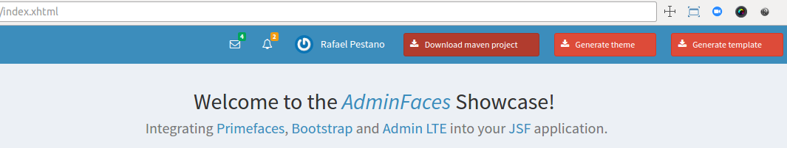

= Admin Designer Toolkit
:page-layout: base
:toc: preamble
:source-language: java
:icons: font
:linkattrs:
:sectanchors:
:sectlink:
:numbered:

:doctype: book
:tip-caption: :bulb:
:note-caption: :information_source:
:important-caption: :heavy_exclamation_mark:
:caution-caption: :fire:
:warning-caption: :warning:

The aim of this application is to make it easier to customize http://github.com/adminfaces/admin-theme[Admin theme^] and http://github.com/adminfaces/admin-template[Admin Template].

== What is it?

This the same http://github.com/adminfaces/admin-showcase[Admin Showcase^] application with `admin template` and `admin theme` bundled inside instead of being project dependencies.

It uses http://wildfly-swarm.io/[Wildfly Swarm^] to run the `exploded` application so one can change the theme or template and see the modifications without needing to restart the application.  

== Objectives

The initial idea was to speed AdminFaces development but it turns out that it can easy `contributions` from non Java developers (like designers and frontend developers) as the project is about front end components and layout.

== How it works

. First download Admin Designer from github releases https://github.com/adminfaces/admin-designer/releases[here^];

. Now in application root directory start it by running the command:
+
----
./mvnw wildfly-swarm:run (or mvnw.cmd wildfly-swarm:run) <1>
----
<1> To use `mvnw` (maven wrapper) you just need Java (JAVA_HOME) installed.
+
. Edit any less file in directory https://github.com/adminfaces/admin-designer/tree/master/src/main/resources/less[`src/main/resources/less`^].
. Now to compile the application using:
+
----
 ./mvnw compile (or mvnw.cmd compile)
----
TIP: If you don't want to compile every time you change a less file, use the flag `-Dlesscss.watch=true`. Or use a tool like http://brackets.io/[brackets^] with https://github.com/jdiehl/brackets-less-autocompile[less extension^] installed.
+
. Finally when you're done you can download the customized `theme` or `template` packed as jar files or even download it as *a zipped maven project*;
+

The changes made to less files should be visible in running application `http://localhost:8080/showcase`

NOTE: There is no need to stop and run the application again.

You can see this workflow in the following video: https://www.youtube.com/watch?v=AGo03YqjyDM
